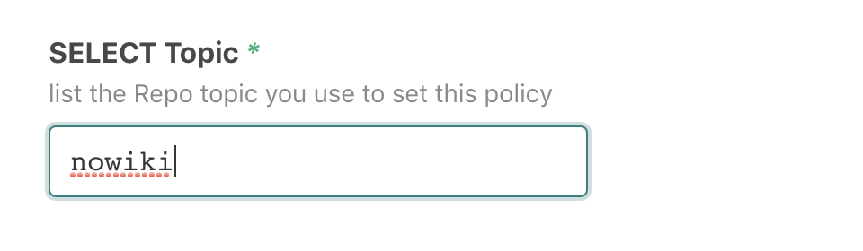
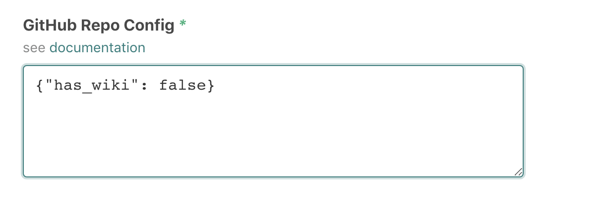

# `@atomist/github-repo-config`

<!---atomist-skill-readme:start--->

Applies standard config policies to all GitHub Repositories.

# What it's useful for

Select Repositories by Topic, and apply a standard configuration (ie disable wikis or issues).

# Before you get started

Connect and configure these integrations:

1. **GitHub**
2. **Slack** (optional)

The **GitHub** integration must be configured in order to use this skill.

When the optional Slack integration is enabled, users can interact with this skill directly from Slack.

# How to configure

1. **Configure Topic Selection**

    Choose a Repo Topic. This will be used to select the set of Repositories to configure.

    

2. **Configure your Desired Repository Configuration**

    Please see [GitHub documentation for supported options](https://developer.github.com/v3/repos/#update-a-repository)

    

3. **Optionally create a cron schedule**

    Re-apply this configuration periodically to ensure it stays in sync.

    

## How to use Git Repo Config

1.  **Do nothing**

    This is a background skill that converges configuration on a schedule.

2.  **Run a sync from Slack**

    Interactively kick off the Skill to synchronize your Repositories.

    ```
    @atomist sync repo config
    ```

<!---atomist-skill-readme:end--->

---

Created by [Atomist][atomist].
Need Help? [Join our Slack workspace][slack].

[atomist]: https://atomist.com/ "Atomist - How Teams Deliver Software"
[slack]: https://join.atomist.com/ "Atomist Community Slack"
